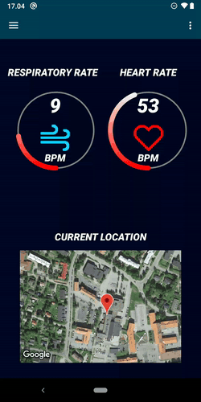

# Health Monitoring App

A comprehensive Android application designed to monitor and visualize health metrics such as heart rate (HR) and respiratory rate (RR) in real-time. The app integrates with Firebase for data storage and retrieval, and provides a user-friendly interface for tracking health data over time.

## Overview

This project demonstrates professional Android development skills through the implementation of real-time health monitoring, data visualization, and integration with Firebase. The app features a clean, modern UI with interactive charts and progress indicators. This app is a part of a school project in collaboration with Murata, We recieved sensors which track vital data such as heart rate and respiratory rate, this data gets pushed into firebase which was used in this app.

## Technologies Used

**Core**  

**Data Handling**  

**UI**  

# Project Components & Features

## 🏠 Home Fragment

Entry point and real-time health monitoring  

- Displays current heart rate (HR) and respiratory rate (RR)  
- Visualizes data using circular progress bars  
- Integrates with Google Maps to show the user's current location  

## 📊 Graph Fragment

Historical data visualization  

- Displays historical HR and RR data using interactive charts  
- Fetches data from Firebase and visualizes it using AAChartCore  

## Configuration

**Required Services for some of the components:**

- Google Maps API
- Firebase Realtime Database

This project was developed as part of a school assignment and showcases a variety of Android development techniques, including real-time data handling, custom UI components, and third-party integrations. Feel free to explore the code and reach out if you have any questions!
