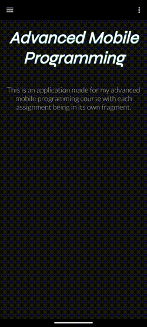

# Advanced Mobile Programming Course App


A comprehensive Android demo application showcasing mobile development techniques and third-party integrations. It also follows a custom made cohesive theming across the entire application.

## Overview

This project demonstrates professional Android development skills through multiple feature modules, including real-time data handling, custom UI components, and integration with various cloud services. Built as part of an advanced mobile programming course, it highlights practices in Android development. I wrote the entire app within 5 days.



## Technologies Used

**Core**  


**Networking**  


**UI**  


# Project Components & Features

## 🏠 Home Fragment

Entry point and app overview  

- Displays welcome message and app introduction  

## 📦 JSON Data Fragment

Fetch and display TODO items from API  

- **Features**:  
  - REST API integration
  - RecyclerView with custom adapter  
  - Item click navigation to detail view  
- **Tech**:  

  ```kotlin
  Volley // Networking
  Gson // JSON parsing
  ```

## 🗺 Maps Integration Fragment

Interactive maps with weather data  

- **Features**:  
  - Google Maps API integration  
  - Marker-based weather data fetching  
  - Multiple map types (Normal/Hybrid/Terrain)  
- **Tech**:  

  ```kotlin
  Google Maps SDK // Core mapping
  OpenWeatherMap API // Weather data
  Volley // API communication
  ```

## 📝 Feedback System fragment

User feedback management  

- **Components**:  
  - `FeedbackReadFragment`: Displays feedback list  
  - `FeedbackSendFragment`: Feedback submission form  
- **Features**:  
  - RecyclerView with dividers  
  - Swipe-to-refresh functionality  
  - Strapi backend integration  
- **Tech**:  

  ```kotlin
  RecyclerView // List display
  DividerItemDecoration // Visual separation
  Volley // Backend communication
  ```

## 🌦 Weather Station Fragment

Real-time weather data monitoring  

- **Features**:  
  - MQTT data streaming  
  - Auto-updating data feed  
  - Custom timestamp formatting  
- **Tech**:  

  ```kotlin
  HiveMQ Client // MQTT broker
  SpinKit // Loading animations
  Gson // Data serialization
  ```

## ☁️ Cloud MQTT Fragment

Real-time messaging demonstration  

- **Features**:  
  - Bi-directional MQTT communication  
  - Message history view  
  - HiveMQ cloud integration  
- **Tech**:  

  ```kotlin
  MQTT 3.1.1 Protocol // Messaging standard
  HiveMQ Client // Cloud connection
  Custom View // Message display
  ```

## 🎨 Custom Views Fragment

Demonstrates custom UI components  

- **Components**:  
  1. `CustomTemperatureView`:  
     - Dynamic color changes based on values  
     - Custom measurement handling  
  2. `LatestDataView`:  
     - Animated data feed  
     - Auto-scrolling functionality  
- **Tech**:  

  ```kotlin
  Custom View classes // UI components
  ValueAnimator // Smooth transitions
  ```

## 🧩 Third-Party Components Fragment

Showcases library integrations  

- **Features**:  
  - AppIntro: Custom onboarding flow  
  - MotionToast: Contextual user notifications  
  - SpinKit: Animated loading indicators  

## Installation

1. **Clone Repository**

2. **API Keys Configuration**
   Add to `local.properties`:

   ```properties
   MAPS_API_KEY=your_google_maps_key
   OWM_KEY=your_openweathermap_key
   STRAPI_TOKEN=your_strapi_token
   ```

  The sections with MQTT were all made using data provided by my school, this data is unfortunately no longer usable but the functionality of the implementation remains.

3. **Build and Run**

## Configuration

**Required Services for some of the components:**

- Google Maps API
- Strapi Backend
- OpenWeatherMap API
